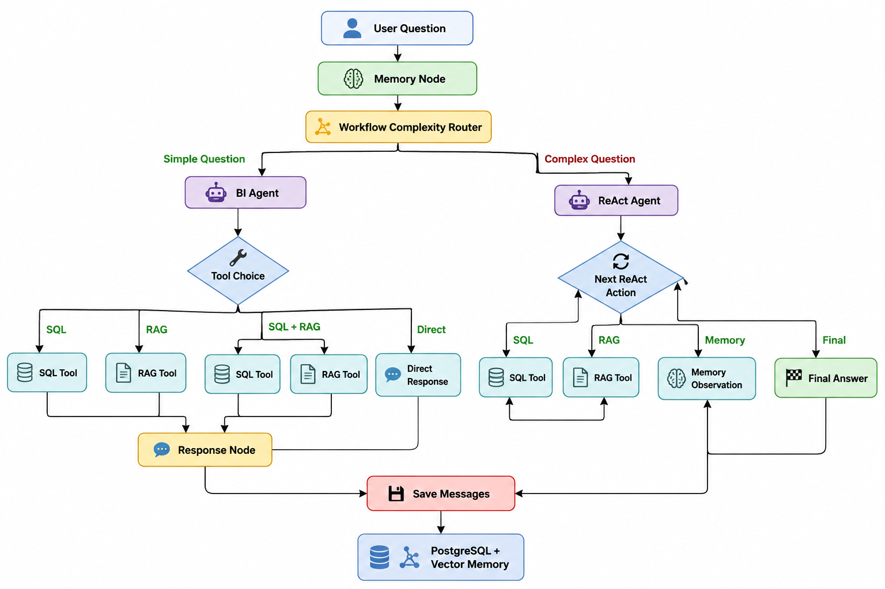
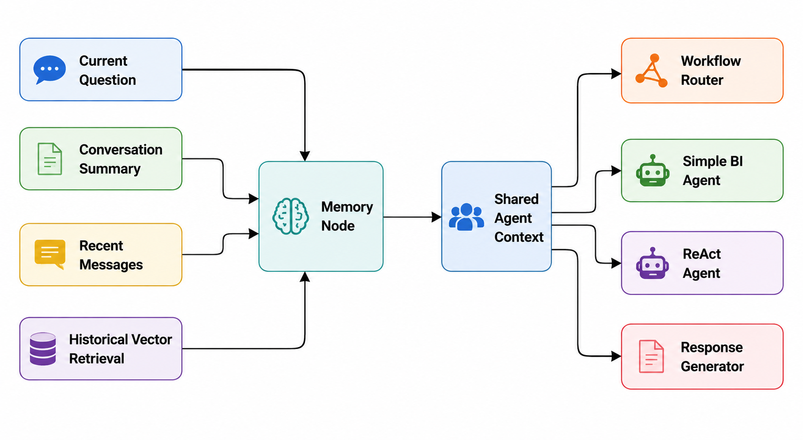

# Business Intelligence Agent System

An enterprise-style Business Intelligence Assistant that answers questions using structured PostgreSQL data, internal company documents, persistent conversational memory, and iterative ReAct reasoning.

The system uses LangGraph for workflow orchestration and custom-built agents for routing, SQL generation, retrieval-augmented generation, memory handling, and multi-step investigation.

> **Project status:** Active MVP development

---

## Overview

Traditional business intelligence systems often require employees to understand database schemas, dashboards, and internal documentation before they can find an answer.

This project provides a conversational interface that can:

* Query structured business data using natural language
* Retrieve company policies and SOPs from internal documents
* Combine SQL results with document guidance
* Understand follow-up questions using conversation memory
* Investigate complex business questions through iterative ReAct reasoning
* Preserve employee-specific conversations in PostgreSQL
* Provide a Streamlit-based chat interface

The current implementation uses a fictional e-commerce company, **NovaCart**, as its enterprise environment.

---

## Key Capabilities

### Natural-Language SQL

The assistant converts business questions into read-only PostgreSQL queries.

Example questions:

```text
How many premium customers do we have?
What is the total revenue by region?
Show all failed payments and their reasons.
How many pending orders are in the system?
```

The SQL tool:

* Reads the live database schema
* Generates PostgreSQL `SELECT` queries
* Blocks write operations
* Prevents access to restricted employee and security information
* Validates generated SQL before execution
* Returns structured results for response generation

---

### Retrieval-Augmented Generation

The RAG workflow retrieves relevant content from internal company documents.

Example questions:

```text
What is the employee PTO policy?
What should support do when a payment fails?
What are the refund approval rules?
What does the IT password policy require?
```

Retrieved chunks include:

* Document content
* Source filename
* Vector distance metadata

---

### Combined SQL and RAG Questions

The assistant can split questions that require both business data and document guidance.

Example:

```text
How many payment failures occurred and what should customer support do according to the SOP?
```

The system separates this into:

```text
SQL question:
How many payment failures occurred?

RAG question:
What steps should customer support follow when a payment fails?
```

The final response combines the database result with the relevant SOP guidance.

---

### Persistent Conversation Memory

Conversation memory is stored outside the graph so it remains available across application restarts.

The memory system combines:

* Conversation summaries
* The six most recent messages
* Semantic retrieval of older messages
* PostgreSQL conversation storage
* Chroma-based historical message retrieval

This allows the assistant to understand follow-up questions such as:

```text
What about their orders?
What did you tell me about payment failures?
What does that policy say about approval?
Summarize what we discussed.
```

---

### ReAct Investigation Workflow

Complex questions are routed to a custom iterative ReAct workflow.

The loop follows:

```text
Thought
  ↓
Action
  ↓
Observation
  ↓
Next Thought
  ↓
Final Answer
```

Available ReAct actions include:

* `sql`
* `rag`
* `memory`
* `clarify`
* `final`

Example:

```text
Analyze payment failures and recommend actions.
```

Possible execution:

```text
Step 1: Query payment-failure data using SQL
Step 2: Retrieve the Payment Failure Handling SOP
Step 3: Combine observations into recommendations
```

ReAct execution is currently limited to four steps to prevent uncontrolled loops.

---

### Hybrid Workflow Routing

The system separates straightforward questions from investigative questions.

```text
User Question
      ↓
Memory Retrieval
      ↓
Workflow Complexity Router
      ├── Simple BI Workflow
      └── ReAct Workflow
```

#### Simple BI Workflow

Used for direct and predictable tasks:

* SQL-only questions
* RAG-only questions
* SQL and RAG questions
* Memory-based direct responses

#### ReAct Workflow

Used for:

* Investigations
* Analysis and recommendations
* Ambiguous follow-ups
* Conflicting results
* Rechecking previous answers
* Multi-step reasoning

This design avoids using the more expensive ReAct loop for every request.

---

## Architecture



---

## Memory Architecture



---

## Technology Stack

| Area                      | Technology        |
| ------------------------- | ----------------- |
| Language                  | Python            |
| Workflow orchestration    | LangGraph         |
| LLM integration           | Ollama            |
| LLM framework components  | LangChain         |
| Relational database       | PostgreSQL        |
| Vector database           | ChromaDB          |
| Document processing       | python-docx       |
| Embeddings                | Ollama embeddings |
| Web interface             | Streamlit         |
| Environment configuration | python-dotenv     |

---

## Project Structure

```text
Business-Intelligence-Agent-System/
│
├── agent/
│   ├── question_transformers/
│   │   ├── rag_transformer.py
│   │   ├── sql_rag_transformer.py
│   │   └── sql_transformer.py
│   ├── agent_prompts.py
│   ├── bi_agent.py
│   ├── complexity_router.py
│   ├── memory_node.py
│   ├── react_agent.py
│   ├── react_prompts.py
│   └── response_node.py
│
├── database/
│   ├── connection.py
│   ├── queries.py
│   └── schema_reader.py
│
├── graph/
│   └── bi_graph.py
│
├── llm/
│   └── llm_client.py
│
├── memory/
│   ├── conversation_store.py
│   ├── memory_vector_store.py
│   └── summarizer.py
│
├── rag/
│   ├── chunker.py
│   ├── document_loader.py
│   ├── embedder.py
│   ├── retriever.py
│   └── vector_store.py
│
├── state/
│   └── agent_state.py
│
├── tools/
│   ├── rag_tool.py
│   └── sql_tool.py
│
├── utils/
│   └── json_utils.py
│
├── app.py
├── main.py
├── requirements.txt
└── README.md
```

---

## Prerequisites

Before running the project, install:

* Python 3.10 or later
* PostgreSQL
* Ollama
* A compatible Ollama generation model
* A compatible Ollama embedding model

The project expects an existing PostgreSQL database containing the business and conversation tables used by the application.

---

## Installation

### 1. Clone the repository

```bash
git clone https://github.com/KoushikRama/Business-Intelligence-Agent-System.git
cd Business-Intelligence-Agent-System
git checkout develop
```

### 2. Create a virtual environment

#### Windows

```bash
python -m venv .venv
.venv\Scripts\activate
```

#### macOS/Linux

```bash
python3 -m venv .venv
source .venv/bin/activate
```

### 3. Install dependencies

```bash
pip install -r requirements.txt
```

### 4. Start Ollama

```bash
ollama serve
```

Pull the generation and embedding models configured in your environment.

Example:

```bash
ollama pull gpt-oss:20b
ollama pull nomic-embed-text
```

Use the model names that match your local configuration.

---

## Environment Configuration

Create a `.env` file in the project root:

```env
# PostgreSQL
DB_HOST=localhost
DB_PORT=5432
DB_NAME=novacart_db
DB_USER=postgres
DB_PASSWORD=your_database_password

# Ollama generation endpoint
OLLAMA_URL=http://localhost:11434/api/generate
OLLAMA_MODEL=gpt-oss:20b
```

Additional embedding or Chroma configuration may be required depending on the values used in `rag/vector_store.py`, `rag/embedder.py`, and `memory/memory_vector_store.py`.

Do not commit `.env` files or real credentials.

---

## Database Requirements

The application currently expects business data such as:

* Customers
* Orders
* Payments
* Employees

It also uses application-memory tables for:

* Conversations
* Messages
* Conversation summaries

The SQL agent dynamically reads the database schema, so generated queries are limited to tables and columns available in the configured PostgreSQL database.

For a reproducible public setup, database migration and seed scripts should be added to the repository.

---

## Running the Application

### Streamlit interface

```bash
streamlit run app.py
```

Alternative:

```bash
python -m streamlit run app.py
```

### Terminal interface

```bash
python main.py
```

---

## Example Questions

### SQL

```text
How many customers are using our services?
How many premium customers do we have?
Show revenue by customer segment.
How many failed transactions are recorded?
```

### RAG

```text
What is the employee PTO policy?
Explain the refund and returns policy.
What does the payment failure SOP require?
What are the customer support escalation steps?
```

### SQL and RAG

```text
How many payment failures occurred and what should support do?
How many refund requests are pending and what approval rules apply?
```

### ReAct

```text
Analyze payment failures and recommend actions.
Investigate why the previous order and payment counts were inconsistent.
Compare failed payments with company policy and assess compliance.
Verify the previous result and explain what caused the discrepancy.
```

### Memory

```text
What was my previous question?
What did we discuss about premium customers?
Summarize our conversation.
What did that policy say about approval?
```

---

## SQL Safety

The SQL tool enforces read-only access.

Allowed:

```sql
SELECT ...
```

Blocked operations include:

```text
INSERT
UPDATE
DELETE
DROP
ALTER
TRUNCATE
CREATE
GRANT
REVOKE
```

The SQL prompt also restricts access to:

* Employee salaries
* Private HR records
* Passwords
* Authentication credentials
* Secrets and tokens

Generated SQL is validated again before database execution.

> The current validation is suitable for an MVP, but production deployments should also use a database user with database-level read-only permissions.

---

## Conversation Management

The Streamlit interface currently supports:

* Employee-specific conversation retrieval
* New conversation creation
* Personalized assistant greeting
* Conversation selection
* Conversation renaming
* Conversation deletion
* Message restoration
* Persistent message storage
* Semantic storage of user and assistant messages

The current branch uses a configured demonstration employee ID in the Streamlit application. Full login-based authentication and role-based authorization remain future enhancements.

---

## Design Decisions

### Why PostgreSQL memory instead of only LangGraph checkpoints?

LangGraph checkpoints are useful for resuming graph execution, but this application requires product-level persistent memory:

* Multiple employees
* Multiple conversations
* Conversation titles
* Rename and delete operations
* Long-term message history
* Conversation summaries
* Semantic historical retrieval

PostgreSQL therefore acts as the system of record, while LangGraph state is used during the current workflow execution.

### Why separate Simple and ReAct workflows?

Straightforward questions do not require iterative reasoning.

A simple workflow reduces unnecessary calls for common tasks, while ReAct is reserved for questions that require investigation, verification, or recommendations.

### Why custom agents?

LangGraph is used primarily as an orchestration engine. Tool selection, ReAct reasoning, question rewriting, memory retrieval, SQL generation, and response composition are implemented as custom application logic to provide greater control over the workflow.

---

## Current Limitations

This repository represents an actively developed MVP.

Known limitations include:

* The Streamlit application currently uses a demonstration employee ID
* Full authentication and role-based authorization are not yet integrated
* PostgreSQL setup and seed scripts are not included
* RAG ingestion currently requires project-specific document setup
* Some SQL statements are constructed using string interpolation
* Prompt behavior still requires additional evaluation and hardening
* Local Ollama latency depends heavily on the selected model and hardware
* No automated test suite or evaluation framework is currently included
* No Docker or production deployment configuration is currently included
* Generated recommendations may require human review before operational use

---

## Planned Enhancements

* Employee authentication
* Role-based access control
* Employee context in all workflows
* Chart and report generation
* Automatic conversation titles
* Prompt evaluation and regression tests
* SQL query parameterization
* Improved authorization at the database and retrieval layers
* Structured logging and tracing
* Latency and token monitoring
* Docker support
* CI/CD pipeline
* Production deployment
* LangGraph checkpointing for interrupted-run recovery
* Human approval for sensitive or high-impact actions

---

## Development Milestones

* [x] Natural-language SQL agent
* [x] Internal-document RAG
* [x] SQL and RAG question splitting
* [x] Persistent conversation storage
* [x] Recent-message memory
* [x] Historical semantic retrieval
* [x] Conversation summarization
* [x] Workflow complexity routing
* [x] Multi-step ReAct reasoning
* [x] Streamlit interface
* [x] Conversation management
* [ ] Authentication
* [ ] Role-based authorization
* [ ] Chart generation
* [ ] Automated evaluations
* [ ] Deployment and monitoring

---

## Security Notice

This project is an educational and portfolio MVP.

Before using it with real enterprise information:

* Replace all string-formatted SQL with parameterized queries
* Store only hashed passwords
* Use a read-only PostgreSQL service account
* Implement role- and department-based authorization
* Filter document retrieval by employee permissions
* Add audit logging
* Add rate limiting
* Validate all generated outputs
* Protect secrets using an approved secret-management solution
* Add human review for sensitive operational recommendations

---

## Author

**Koushik Rama**

Built as an exploration of enterprise AI assistants, natural-language business intelligence, retrieval-augmented generation, persistent conversational memory, and agentic reasoning.

---

